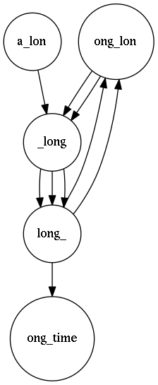

### -------Note: Under construction--------

# Superbubble Performance 

Test of the different super-bubble identifications algorithms in 
genome sequencing

## Table of Contents
1. [Basic Pipeline flow](#basic-architecture-diagram)
2. [Graph construction example](#graph-construction-example)
    1. [Generated graphs](#generated-graphs)
    2. [Generated DB Tables](#generated-tables)
3. [Superbubble Algorithms](#superbubble-algorithms)
    1. [Linear time SuperBubble identification](#linear-algo)
    2. [Quasi-linear time SuperBubble identification](#qlinear-algo)
    3. [Quadratic time SuperBubble identification](#quadratic-algo)
4. [Citations](#citations)
5. [Platforms Supported](#platforms-supported)
6. [License](#license)


---
## Basic Pipeline Flow <a name="basic-architecture-diagram"></a>


__Description__

- FASTA formatted sequencer reads get parsed into the GraphConstructor.
- The GraphConstructor create the graph from the reads and a K-mer length provided.
- The WeightedGraph data structure goes through the compressor to concatenate nodes
  where possible.
- The GraphIndexer creates an index of all the K-mers (nodes) in the graph and
  constructs a indexed WeightedGraph equivalent of the K-mer string graph.
- The GraphIndexer sends the indexed K-mers and indexed Edges to the database for storage.
- The GraphIndexer sends the indexed graph to the SuperBubble algorithm driver class.
- The SuperBubble driver saves the identified SuperBubbles in the graph to the Database.
- Optionally benchmarks for the SuperBubble algorithms are written to a file.
- Optionally both kmer graphs and indexed graph can be exported to Dot format.


---
## Graph construction example <a name="graph-construction-example"></a>

Using a single read sequence "_a_long_long_long_time_" with K-mer length of _5_.


### Graphs generated <a name="generated-graphs"></a>

| Original | Compressed | Indexed | Reconstructed |
|:---:|:---:|:---:|:---:|
|  | | | 

- __Original__: graph constructed from the sequencer reads.
- __Compressed__: graph where compressable K-mer node sequences were concatenated.
- __Indexed__: graph where all K-mer node strings were indexed
- __Reconstructed__: reconstructed graph from the index and edge tables in the database.

### Database tables <a name="generated-tables"></a>

- Index for the Kmer strings

| ID  | Kmer     |
|:---:|:---------|
|  0  | ong_lon  |
|  1  | ong_time |
|  2  | a_lon    |
|  3  | long_    |
|  4  | _long    |

- Edges

| FromID | To_ID | Weight |
|:------:|:-----:|:------:|
|    0   |   4   |    2   |
|    2   |   4   |    1   |
|    3   |   1   |    1   |
|    3   |   0   |    2   |
|    4   |   3   |    3   |

- Graphs table (lists all the graphs stored in the database)

| GraphID |  Name  |
|:-------:|:-------|
|    1    | Test01 |

The Edge and Kmer index tables are created by concatenating
the GraphID (_n_) with the type of table: '_edges_n' and '_kmers_n_'.

__E.g.__: For '_Test01_' above, the Edge table would be named '_edges_1_'
and the Kmer index table '_kmers_1_'.

---
## Superbubble Algorithms <a name="superbubble-algorithms"></a>


The ````algo::SB_Driver```` acts as a gateway to the implemented SuperBubble algorithms. 
An ````eadlib::WeightedGraph<size_t>```` describing an indexed 
[deBruijn graph](http://www.homolog.us/Tutorials/index.php?p=2.1&s=1) (essentially a bi-directional multi-graph)
is passed onto the algorithm(s) selected during runtime.

//TODO pic of example graph that is used

### Quadratic time SuperBubble identification <a name="quadratic-algo"></a>

### Quasi-linear time SuperBubble identification <a name="qlinear-algo"></a>

#### Stage 1: Preparation

##### a) Finding Strongly Connected Components in the graph

All [SCCs](https://en.wikipedia.org/wiki/Strongly_connected_component) are found in the graph using 
[Tarjan's algorithm](https://en.wikipedia.org/wiki/Tarjan's_strongly_connected_components_algorithm) 
and returned in the form of ````std::list<std::list<size_t>```` where each 
````std::list<size_t>```` is a set of 1 or more node ID(s) from the graph that makes up an SCC.

//TODO SCCs found pic

All [singleton](https://en.wikipedia.org/wiki/Singleton_(mathematics)) SCCs in the list
(i.e.: any SCC with just 1 node) are combined as a single set.

//TODO SCCs with combined singleton pic

##### b) Partitioning the graph


### Linear time SuperBubble identification <a name="linear-algo"></a>


---
## Citations <a name="citations"></a>

__Linear time superbubble identification based on:__ <a name="cite-linear"></a>

L. Brankovic, C. S. Iliopoulos, R. Kundu, M. Mohamed, S. P. Pissis, F. Vayani, 
"[Linear-Time Superbubble Identification Algorithm for Genome Assembly](http://www.sciencedirect.com/science/article/pii/S0304397515009147)", 
Theoretical Computer Science, 2015.

__Quasi-Linear time superbubble identification based on:__ <a name="cite-qlinear"></a>
 
Wing-Kin Sung, Kunihiko Sadakane, Tetsuo Shibuya, Abha Belorkar, and Iana Pyrogova, 
"[An O(_m_ log _m_)-Time Algorithm for Detecting Superbubbles](http://ieeexplore.ieee.org/document/6998850/?reload=true&arnumber=6998850)",
IEEE/ACM Transactions on Computational Biology and Bioinformatics, Vol. 12, No. 4, July/August 2015


//TODO cite the papers for the algos used (quadratic)


---
## Platforms supported <a name="platforms-supported"></a>

The software is bundled with components belonging to the "EADlib" library.

### Linux ツ ###
- Need a version of GCC/Clang with C++14 support (made with GCC 6.2.1)
- CMake 3.5

### Mac OSX ###

- See above.
- Homebrew might help. Untested.
 
### Windows ###

- You are on your own.

---
## License <a name="license"></a>

This software is released under the [__GNU General Public License 2__](https://www.gnu.org/licenses/old-licenses/gpl-2.0.en.html) license.

Please reference when used in project and/or research and/or papers and/or integrated in production code (i.e.: DBAD).